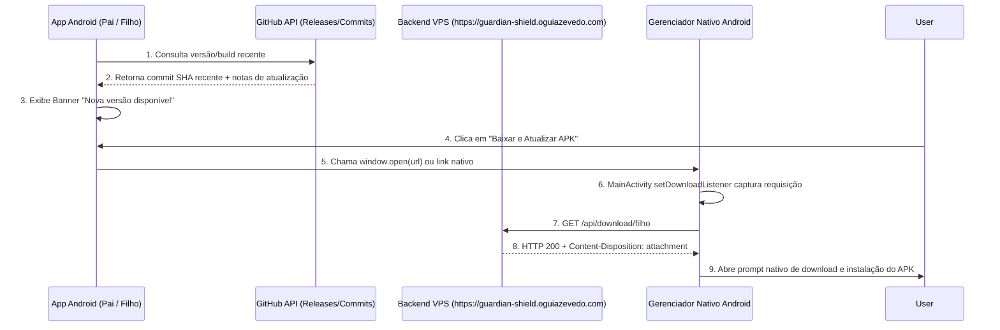

# 🛡️ Guardian Shield - Documentação da Solução de Auto-Atualização Direta (In-App APK Auto-Update & Native Android Navigation)

**Autor:** Guilherme S Azevedo  
**Website:** [https://oguiazevedo.com](https://oguiazevedo.com)  
**Data:** 7 de Agosto de 2026  

---

## 📋 Visão Geral da Solução

O **Guardian Shield** é um sistema completo de controle parental composto por 3 partes principais:
1. **`guardian-shield-parents`** (App Pai / Administrador)
2. **`guardian-shield-kid`** (App Filho / Gerenciado)
3. **`guardian-shield-backend`** (Servidor em Nuvem Node.js/Express na VPS `https://guardian-shield.oguiazevedo.com`)

O objetivo desta implementação foi permitir que ambos os aplicativos Android verifiquem automaticamente atualizações e permitam o **download direto e a instalação de novas versões do APK em 1 clique** diretamente dentro do app, sem depender de navegação manual pelo GitHub.

---

## 🎯 Desafios Enfrentados e Soluções Aplicadas

### 1. Incompatibilidade do WebView do Android com Downloads de Arquivos `.apk`
- **Problema**: Por padrão, o `WebView` nativo do Android (usado pelo Capacitor) ignora eventos de download. Ao tentar redirecionar a página interna (`window.location.href`), o WebView tentava interpretar o arquivo binário `.apk` como HTML, gerando a tela de erro `Cannot GET`.
- **Solução Nativa**: Sobrescrição da classe nativa Java `MainActivity` em ambos os apps (`parent-app` e `child-app`), adicionando um `DownloadListener` nativo que captura URLs de download e as repassa via `Intent(Intent.ACTION_VIEW)` ao Gerenciador de Downloads nativo do Android:

```java
// android/app/src/main/java/com/guardianshield/child/MainActivity.java
package com.guardianshield.child;

import android.content.Intent;
import android.net.Uri;
import android.os.Bundle;
import com.getcapacitor.BridgeActivity;

public class MainActivity extends BridgeActivity {
    @Override
    public void onCreate(Bundle savedInstanceState) {
        super.onCreate(savedInstanceState);
        
        // Habilita a captura de downloads no WebView nativo
        if (this.bridge != null && this.bridge.getWebView() != null) {
            this.bridge.getWebView().setDownloadListener((url, userAgent, contentDisposition, mimetype, contentLength) -> {
                try {
                    Intent intent = new Intent(Intent.ACTION_VIEW);
                    intent.setData(Uri.parse(url));
                    startActivity(intent);
                } catch (Exception e) {
                    e.printStackTrace();
                }
            });
        }
    }

    @Override
    public void onBackPressed() {
        if (this.bridge != null && this.bridge.getWebView() != null && this.bridge.getWebView().canGoBack()) {
            this.bridge.getWebView().goBack();
        } else {
            this.bridge.triggerJSEvent("backButton", "document");
        }
    }
}
```

---

### 2. Prevenção de Encerramento do App no Botão "Voltar" do Android
- **Problema**: Ao pressionar o botão físico ou gesto de "Voltar" do Android, o aplicativo encerrava a atividade nativa (`Activity.finish()`), fechando o app.
- **Solução**:
  1. Sobrescrição do método `onBackPressed()` no Java nativo para emitir o evento nativo `backButton` para o documento JavaScript em vez de fechar o app.
  2. Integração no React com o plugin `@capacitor/app`:

```javascript
// Trata o botão voltar no React sem fechar o aplicativo
useEffect(() => {
  const handleBack = () => {
    if (showModal) {
      setShowModal(false);
    } else if (activeTab !== 'home') {
      setActiveTab('home');
    }
  };

  const backListener = CapApp.addListener('backButton', handleBack);
  document.addEventListener('backButton', handleBack);

  return () => {
    backListener.then(l => l.remove());
    document.removeEventListener('backButton', handleBack);
  };
}, [showModal, activeTab]);
```

---

### 3. Servimento de APKs e Forçamento do Cabeçalho `Content-Disposition` no Backend Express
- **Problema**: Quando o navegador ou WebView requisitava um arquivo `.apk`, se o servidor não enviasse o cabeçalho `Content-Disposition: attachment`, o Chrome tentava renderizar o binário inline.
- **Solução no Backend Node.js (`server.js`)**:
  1. Criação da pasta estática `apks/` dentro do próprio repositório `guardian-shield-backend`.
  2. Configuração de rotas de download com `res.download()` que adicionam automaticamente o cabeçalho HTTP de download de arquivo:

```javascript
// backend/server.js
const APKS_DIR = path.join(__dirname, 'apks');
if (!fs.existsSync(APKS_DIR)) {
  fs.mkdirSync(APKS_DIR, { recursive: true });
}

// Rota de download direto do app do Filho
app.get(['/api/download/filho', '/apks/GuardianShield-Filho.apk'], (req, res) => {
  const localFile = path.join(APKS_DIR, 'GuardianShield-Filho.apk');
  if (fs.existsSync(localFile)) {
    return res.download(localFile, 'GuardianShield-Filho.apk');
  }
  res.redirect('https://github.com/nevermind1999/guardian-shield-kid/releases/latest/download/GuardianShield-Filho.apk');
});

// Rota de download direto do app do Pai
app.get(['/api/download/pai', '/apks/GuardianShield-Pai.apk'], (req, res) => {
  const localFile = path.join(APKS_DIR, 'GuardianShield-Pai.apk');
  if (fs.existsSync(localFile)) {
    return res.download(localFile, 'GuardianShield-Pai.apk');
  }
  res.redirect('https://github.com/nevermind1999/guardian-shield-parents/releases/latest/download/GuardianShield-Pai.apk');
});
```

---

### 4. Versionamento dos APKs para Deploy Automático na VPS via Git Pull
- **Problema**: A VPS rodava um `git pull` automático via cron, mas os arquivos de APK eram ignorados pelo `.gitignore`.
- **Solução**:
  - Remoção de bloqueios de `.apk` na pasta `apks/` do repositório `guardian-shield-backend`.
  - Inclusão dos binários copilados (`GuardianShield-Filho.apk` e `GuardianShield-Pai.apk`) no versionamento Git.
  - Ao rodar `git pull` na VPS, os APKs atualizados chegam automaticamente a `/opt/guardian-shield-backend/apks/` e são servidos diretamente da memória do disco local.

---

### 5. Bloqueio Inviolável em Tela Cheia no Android (`SYSTEM_ALERT_WINDOW` & Persistent Lock)
- **Problema**: Ao acionar a "Pausa Geral" ou quando o tempo diário expirava, o bloqueio aparecia apenas dentro do WebView. Se a criança minimizasse o app ou usasse a tecla Home, ela conseguia acessar o TikTok, YouTube, jogos e configurações normalmente. Além disso, o modo de fixação simples do Android (`startLockTask`) exibia uma mensagem do próprio sistema ensinando como desfixar o aplicativo.
- **Solução Nativa Aplicada**:
  1. **Janela de Sobreposição Nativa (`LockOverlayService.java`)**:
     Criado o serviço `LockOverlayService` usando `WindowManager` com permissão de sobreposição de sistema (`TYPE_APPLICATION_OVERLAY`). Essa janela cobre **100% da tela do Android** com o aviso **"🔒 DISPOSITIVO BLOQUEADO"** por cima de qualquer aplicativo em execução (TikTok, YouTube, Jogos, Launcher, Configurações).
  2. **Persistência em Disco (`SharedPreferences`)**:
     O estado de bloqueio é gravado em `SharedPreferences` (`GuardianShieldPrefs`). O `ParentalAccessibilityService.kt` consulta essa chave em tempo real a cada alteração de janela no Android. Se a Pausa Geral estiver ativa, o serviço intercepta imediatamente e força o retorno para a tela de bloqueio.
  3. **Remoção de Dicas do Sistema**:
     Removida a fixação simples do Android para garantir que o sistema não dê dicas de desfixação.

---

## 🏗️ Estrutura Final do Projeto

```
controle-parental/
├── backend/                             # Repositório GitHub: guardian-shield-backend
│   ├── apks/                            # Contém os APKs prontos para download
│   │   ├── GuardianShield-Filho.apk
│   │   └── GuardianShield-Pai.apk
│   ├── server.js                        # Express server com rotas /api/download/
│   └── nginx-guardian-shield.conf       # Template de Nginx SSL para VPS
│
├── child-app/                           # Repositório GitHub: guardian-shield-kid
│   ├── android/app/src/main/java/.../MainActivity.java # Java nativo com setDownloadListener
│   ├── src/App.jsx                      # App React com detecção de hardware do Samsung A06
│   └── src/services/updater.js          # Service de auto-update via GitHub API
│
└── parent-app/                          # Repositório GitHub: guardian-shield-parents
    ├── android/app/src/main/java/.../MainActivity.java # Java nativo com setDownloadListener
    ├── src/App.jsx                      # App React Pai com suporte a pareamento Socket.IO e QR Code
    └── src/services/updater.js          # Service de auto-update via GitHub API
```

---

## 🚀 Fluxo de Funcionamento do Auto-Update no Aparelho



---

## 📌 Créditos & Manutenção
- **Desenvolvedor:** Guilherme S Azevedo
- **URI do Autor:** [https://oguiazevedo.com](https://oguiazevedo.com)
- **Status:** Produção — Totalmente Funcional 🎉
